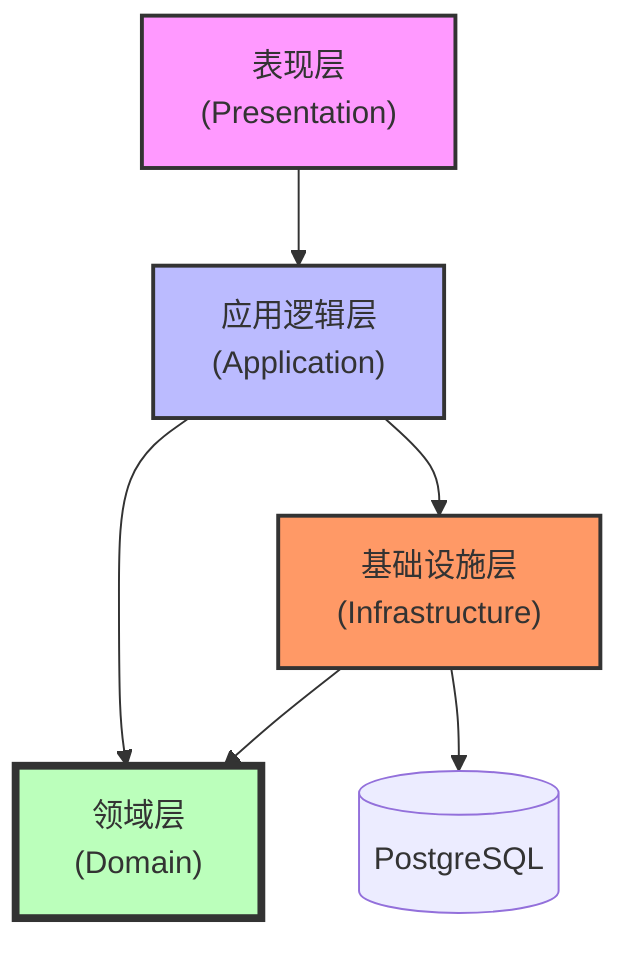

# 选课管理系统 (Course Selection System)

[](https://en.cppreference.com/w/cpp/23)
[](LICENSE)
[]()

基于 **C++23 Modules** 和 **领域驱动设计 (DDD)** 的现代化 4 层架构选课系统。

---

## 项目概述

本项目旨在实现一个严格遵循 **4 层架构** 的企业级选课管理系统，通过 **领域驱动设计 (DDD)** 思想彻底将业务逻辑与数据存储分离，杜绝传统面向过程编程和数据库中心化设计的弊端。系统采用最新的 C++23 标准开发，展示了 C++ Modules 在大型项目中的工程实践。

系统完整支持 **教学秘书**、**学生**、**教师** 三种角色的核心业务流，并通过 **代理者模式 (Proxy Pattern)** 实现 PostgreSQL 数据持久化，确保领域模型的纯净性。

## 核心特性

*   **严格分层架构**：表现层、应用层、领域层、基础设施层职责界限清晰，单向依赖。
*   **现代 C++ 技术栈**：全面采用 C++23 标准，使用 Modules 替代头文件，提升编译速度与代码隔离性。
*   **纯粹领域模型**：领域对象（Student/Course/Teacher）仅包含业务逻辑，**严禁** 包含 SQL 语句或数据库依赖。
*   **数据持久化**：通过 Infrastructure 层的代理类（Proxy）封装 PostgreSQL 访问，实现对象与关系数据库的映射 (ORM)。
*   **CLI 交互系统**：基于终端的菜单驱动界面，提供流畅的用户体验。
*   **复杂业务规则**：内置时间冲突检测、容量控制、成绩管理等核心业务逻辑。

## 系统架构与目录结构

### 4 层架构设计

系统严格遵循分层架构原则，各层代码物理分离，确保低耦合。



### 项目目录结构详细说明

```text
/root/CourseSelectionSystem/CourseSelectionSystem/
├── doc/                                        # 📚 项目文档中心
│   ├── 01_项目需求开发文档/                    #   [需求设计]
│   │   ├── 选课系统需求规格说明书.md            #     包含架构设计、UML图与数据库Schema
│   │   └── 选课系统需求规格说明书.assets/       #     需求文档引用的图片资源
│   ├── 02_查询文档/                            #   [开发指南]
│   │   └── 快速加入选课管理系统开发.md          #     环境配置、Git规范与工具使用手册
│   ├── 03_分工管理文档/                        #   [项目管理]
│   │   ├── [vX.0]项目分工.md                   #     各阶段任务分配记录
│   │   └── [v5.0] 选课系统技术对接文档...      #     前后端对接细节
│   ├── 04_展示文件/                            #   [展示汇报]
│   │   ├── PPT_选课管理系统项目展示.pptx       #     项目汇报 PPT
│   │   ├── 演讲稿_选课管理系统项目展示.docx     #     配套演讲稿
│   │   └── 展示视频_选课管理系统项目.mp4        #     项目演示视频
│   ├── 05_开发心得/                            #   [总结复盘]
│   │   └── 高扬的开发心得.md                   #     成员开发体会
│   └── CourseSelectionSystem.drawio.svg        # UML类图
│
├── src/                                        # 💻 源代码工作区
│   ├── course_data.txt                         #   [初始化数据] 课程基础信息 (ID,名称,容量,学分,教师,时间)
│   ├── student_data.txt                        #   [初始化数据] 学生基础信息 (ID,姓名)
│   ├── test_inputs.txt                         #   [自动化测试] CLI 输入序列脚本 (用于场景测试)
│   ├── CQNU.png                                #   [资源] 应用程序图标
│   ├── CourseSelectionSystem.desktop           #   [部署] Linux 桌面快捷方式配置文件
│   ├── for_md.py                               #   [工具] 源码归档与文档生成脚本
│   │
│   ├── lib_db_core/                            #   [底层库] 数据库连接核心库
│   │   ├── include/                            #     头文件接口
│   │   └── src/                                #     基于 libpqxx 的底层封装实现
│   │
│   └── CourseSelectionSystem/                  #   [主项目] 选课系统应用源码
│       ├── CMakeLists.txt                      #     构建脚本 (配置 C++23 Modules)
│       ├── main.cpp                            #     程序入口 (启动依赖注入与主循环)
│       ├── course_system.cppm                  #     主模块接口定义
│       │
│       ├── presentation/                       #     [表现层 Presentation Layer]
│       │   └── pres.cli.cppm                   #       CLI 菜单系统、用户交互逻辑
│       │
│       ├── application/                        #     [应用层 Application Layer]
│       │   └── app.controller.cppm             #       系统控制器，协调领域对象与基础设施
│       │
│       ├── domain/                             #     [领域层 Domain Layer] (核心业务)
│       │   ├── dom.course.cppm                 #       课程实体 (Course)
│       │   ├── dom.student.cppm                #       学生实体 (Student)
│       │   ├── dom.teacher.cppm                #       教师实体 (Teacher)
│       │   ├── dom.timeslot.cppm               #       值对象: 时间槽 (TimeSlot) - 含冲突检测逻辑
│       │   └── domain.cppm                     #       领域层模块汇总
│       │
│       └── infrastructure/                     #     [基础设施层 Infrastructure Layer]
│           ├── infra.db_adapter.cpp            #       数据库适配器实现
│           ├── infra.db_adapter.cppm           #       数据库适配器接口模块
│           ├── infra.course_proxy.cppm         #       课程代理 (实现 Lazy Loading & Persistence)
│           ├── infra.student_proxy.cppm        #       学生代理
│           ├── infra.enrollment_proxy.cppm     #       选课关系代理
│           ├── infra.dtos.cppm                 #       数据传输对象 (DTOs)
│           └── infrastructure.cppm             #       设施层模块汇总
│
├── .gitignore                                  # Git 忽略规则配置
└── README.md                                   # 项目主页说明文档
```

## 快速开始使用项目

### 环境要求

*   **OS**: Linux
*   **Compiler**: gcc (GCC) 15.2.1 20250813 (支持 C++23 Modules)
*   **Build System**: cmake version 4.1.1
*   **Database**:postgres (PostgreSQL) 17.5 ——icu 76.1
*   **Dependencies**: `libpqxx` (PostgreSQL C++ client)

### 配置运行

```bash
# 前提
项目默认数据库配置：
使用 PostgreSQL的 CourseSelectionSystem数据库，登录管理员账号为"postgres"，密码为"123"，ip地址为"127.0.0.1"，端口号为"5432"
按需修改src/CourseSelectionSystem/application/app.controller.cppm文件里的133行——SystemController::initialize()初始化函数中的默认数据库初始化连接
#  构建步骤
# 1. 克隆仓库
git clone https://github.com/Gsheep0729/CourseSelectionSystem.git
cd CourseSelectionSystem

# 3. 创建构建目录
cd src/CourseSelectionSystem
mkdir build && cd build

# 4. 配置项目
cmake .. 

# 5. 编译
cmake --build .
```

### 运行系统

```bash
./CourseSelectionSystem
```

## 开发者工具

### for_md.py 代码归档工具

本项目内置了一款由 GY 设计的高效代码归档工具 `src/for_md.py`，用于将项目源码整合为 Markdown 文档，便于进行代码审查或知识库构建。

*   **功能**: 智能过滤构建产物，支持 C++/CMake/SQL 等语法高亮，构建文件优先展示。
*   **用法**:
    ```bash
    cd src
    python for_md.py
    # 根据提示输入目标目录路径，即可生成 _knowledge_base.md
    ```

---

## 作者与贡献
Lead Developer: GY (架构设计, 核心模块, C++ Modules 迁移)
Developer: Zhang Tao (表现层, 基础设施层实现)

---

Copyright © 2026 Gao Yang& Zhang Tao. All Rights Reserved.