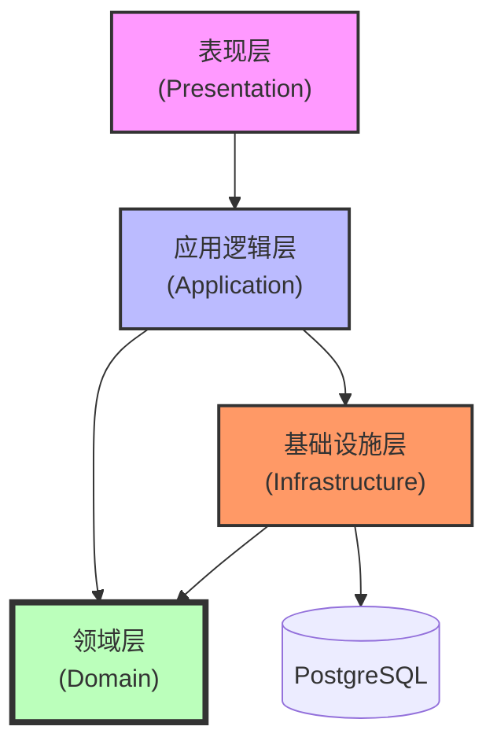
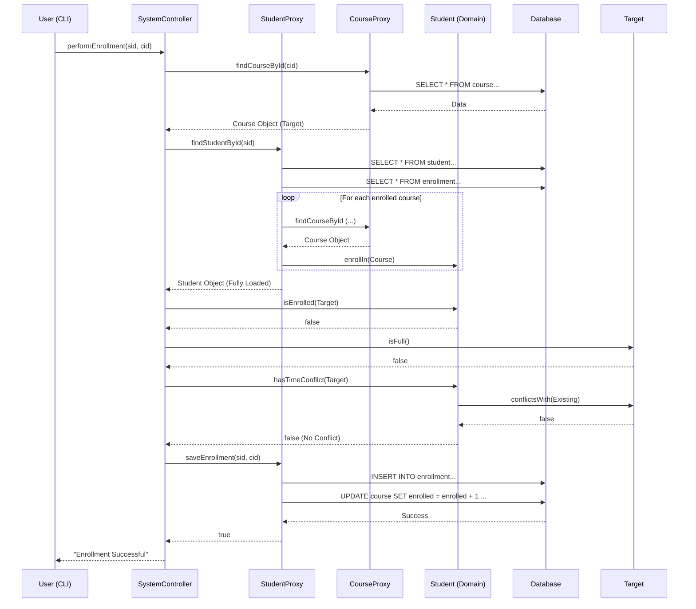

# 业务逻辑与架构详细设计文档

## 1. 引言

本文档旨在补充《需求规格说明书》与《数据库设计文档》，深入阐述选课管理系统的内部运行机制。重点描述 **应用层(Application)**、**领域层(Domain)** 与 **基础设施层(Infrastructure)** 之间的交互逻辑，以及核心业务规则的代码级实现方案。

本文档适用于核心开发人员，用于指导代码实现、代码审查及后续维护。

## 2. 总体架构设计

系统采用严格的 **领域驱动设计 (DDD)** 分层架构，利用 C++23 Modules 实现物理隔离，确保关注点分离。

### 2.1 模块依赖关系



### 2.2 分层职责

| 层级 | 模块 | 核心职责 | 关键组件 |
| :--- | :--- | :--- | :--- |
| **表现层** | `presentation` | 处理用户输入，显示结果，不包含业务逻辑。 | `Menu`, `CliUtils` |
| **应用层** | `application` | 协调业务流程，管理事务，控制权限，不处理SQL。 | `SystemController` |
| **领域层** | `domain` | 封装核心业务规则与状态，**纯内存操作，无数据库依赖**。 | `Student`, `Course`, `Timeslot` |
| **基础设施层** | `infrastructure` | 负责对象的持久化与重建，实现数据库适配。 | `StudentProxy`, `CourseProxy` |

## 3. 应用层详细设计 (Application Layer)

`SystemController` 是整个系统的“大脑”，负责编排业务流程。

### 3.1 权限与会话管理

系统通过 `m_currentUser` 维护当前登录用户的状态，实现基于角色的访问控制 (RBAC)。

*   **会话结构**：
    ```cpp
    struct User {
        std::string id;
        std::string name;
        std::string role; // "student", "teacher", "secretary"
    };
    ```
*   **鉴权机制**：所有业务方法（如 `performEnrollment`）首先检查 `m_currentUser.isValid()` 及其 `role` 属性。
*   **登录流程**：
    1.  接收用户输入的 ID 和密码。
    2.  查询 `users` 表验证凭据。
    3.  成功则填充 `m_currentUser`，失败则保持无效状态。

### 3.2 核心业务编排：选课 (Enrollment)

选课操作体现了典型的四步走流程：**鉴权 -> 加载 -> 校验 -> 持久化**。

1.  **鉴权**：确认当前用户是学生，且操作的是自己的账户。
2.  **资源加载 (Load)**：
    *   调用 `CourseProxy::findCourseById` 获取目标课程对象。
    *   调用 `StudentProxy::findStudentById` 获取学生对象（Proxy 会自动通过 JOIN 查询加载该学生已选的所有课程对象，构建完整的对象图）。
3.  **规则校验 (Validate)**：
    *   **重复性校验**：调用 `Student::isEnrolled`。
    *   **容量校验**：调用 `Course::isFull`。
    *   **冲突校验**：调用 `Student::hasTimeConflict` (核心算法)。
4.  **持久化 (Persist)**：
    *   如果所有校验通过，调用 `StudentProxy::saveEnrollment` 将关系写入数据库。
    *   **注意**：应用层不直接修改内存中的 Domain 对象，而是依赖 Proxy 写入数据库。若需更新显示，通常重新加载或手动同步。

## 4. 领域层详细设计 (Domain Layer)

领域层包含系统最核心的业务规则，**严禁引入任何数据库依赖 (如 SQL 语句)**。

### 4.1 实体模型

*   **Student**：聚合根。维护 `std::vector<Course*> m_courses`。
    *   职责：管理个人的选课列表，检测个人时间表冲突。
*   **Course**：实体。包含 `Timeslot` 值对象。
    *   职责：管理课程容量，定义自身的上课时间。
*   **Timeslot**：值对象。
    *   职责：封装 `weekday` (1-7) 和 `period` (1-5)，提供重叠检测逻辑。

### 4.2 核心算法：时间冲突检测

冲突检测采用 **双重委派 (Double Dispatch)** 机制：

1.  **第一层 (`Student`)**：遍历学生已选的每一门课程。
    ```cpp
    bool Student::hasTimeConflict(const Course* target) const {
        for (auto* current : m_courses) {
            if (current->conflictsWith(*target)) return true;
        }
        return false;
    }
    ```
2.  **第二层 (`Course`)**：将请求委托给自身的 `Timeslot` 组件。
    ```cpp
    bool Course::conflictsWith(const Course& other) const {
        return m_timeslot.overlaps(other.m_timeslot);
    }
    ```
3.  **底层实现 (`Timeslot`)**：执行具体的数值比较。
    ```cpp
    bool Timeslot::overlaps(const Timeslot& other) const {
        // 网络课 (weekday=0) 不冲突
        if (m_weekday == 0 || other.m_weekday == 0) return false;
        // 简单策略：完全相等即冲突
        return (m_weekday == other.m_weekday) && (m_period == other.m_period);
    }
    ```

## 5. 基础设施层详细设计 (Infrastructure Layer)

基础设施层通过 **数据映射器 (Data Mapper)** 模式（实现为 Proxy）隔离领域模型与数据库模式。

### 5.1 对象组装 (Object Reconstitution)

当从数据库加载 `Student` 时，Proxy 必须负责重建完整的对象图，以保证领域规则（如冲突检测）能正确执行。

*   **`StudentProxy::findStudentById` 实现逻辑**：
    1.  `SELECT * FROM student ...` -> 创建 `Student` 基本对象。
    2.  `SELECT course_id FROM enrollment ...` -> 获取所有已选课程 ID。
    3.  循环调用 `CourseProxy::findCourseById` 加载每个 `Course` 对象。
    4.  调用 `student->enrollIn(course)` 将课程填入学生对象的内存列表中。
    
    > **关键点**：这确保了当 Application 层拿到 `Student` 对象时，它已经包含了所有已选课程信息，从而可以立即进行内存中的冲突检测，无需再次查询数据库。

### 5.2 事务性持久化

`StudentProxy::saveEnrollment` 保证数据的一致性：
1.  向 `enrollment` 表插入记录。
2.  原子性地更新 `course` 表的 `enrolled` 计数 (`UPDATE course SET enrolled = enrolled + 1 ...`)。

## 6. 核心交互时序图

### 6.1 学生选课流程 (Enrollment Sequence)


